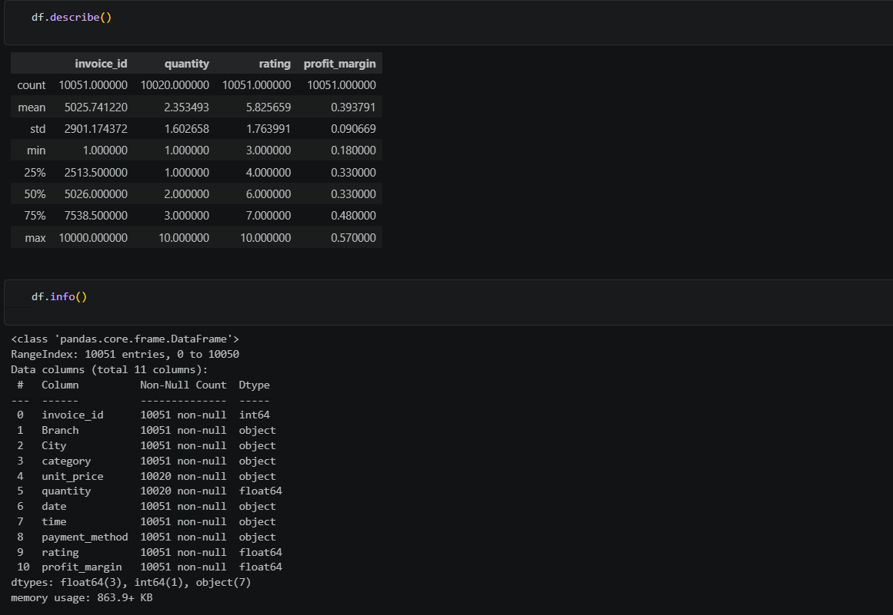
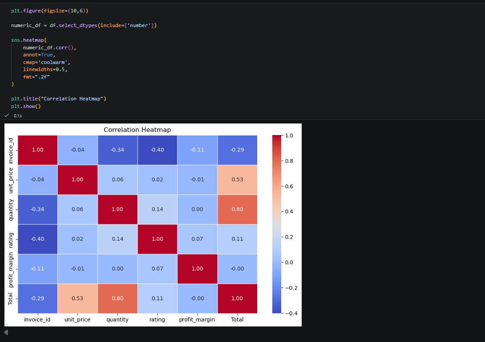
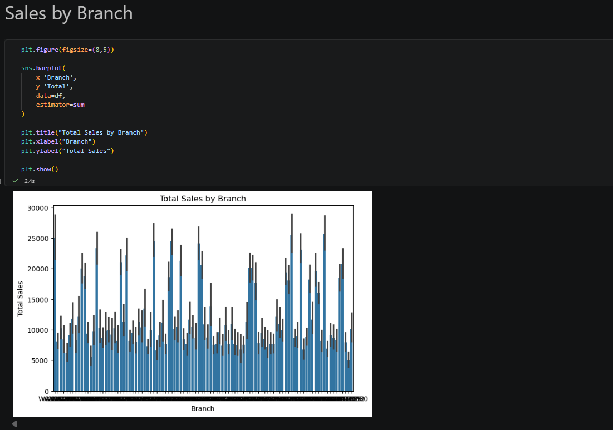
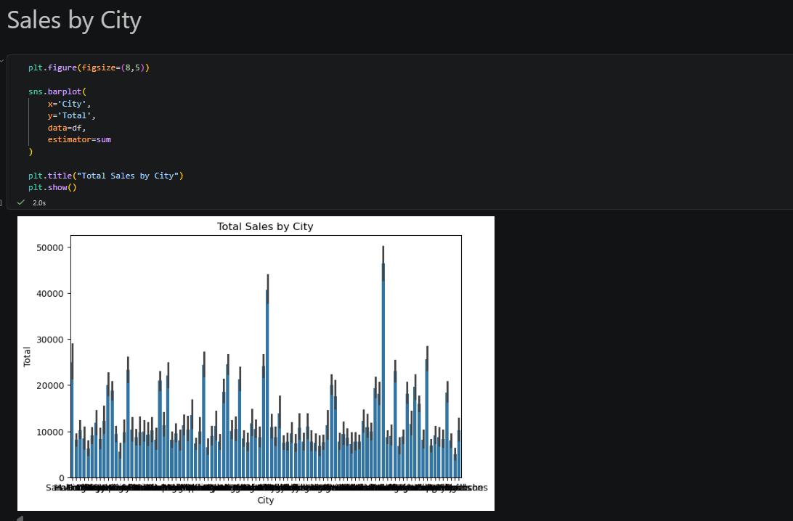
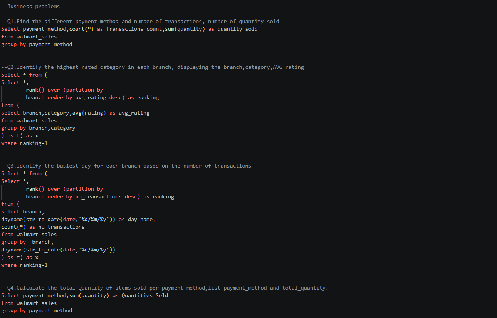

# 🛒 Walmart Sales Analytics 

## 📌 Project Overview

This project presents an end-to-end Exploratory Data Analysis (EDA) of Walmart Sales data using **Python** and **SQL**. The objective is to clean the dataset, perform comprehensive data analysis, generate business insights, and answer real-world business questions using advanced SQL queries.

The project demonstrates data preprocessing, visualization, statistical analysis, and SQL-based business intelligence techniques commonly used by Data Analysts.

---

## 🚀 Tech Stack

- Python
- MySQL
- Pandas
- NumPy
- Matplotlib
- Seaborn
- Jupyter Notebook
- Git
- GitHub

---

## 📂 Project Structure

```
Walmart-Sales-Analytics/
│
├── data/
│   └── Walmart.csv
│
├── notebooks/
│   └── Walmart_Sales_Analysis.ipynb
│
├── sql/
│   └── Walmart_SQL_Analysis.sql
│
├── images/
│   ├── dataset_preview.png
│   ├── correlation_heatmap.png
│   ├── sales_by_branch.png
│   ├── sales_by_city.png
│   ├── sql_query_1.png
│   └── sql_query_2.png
│
├── README.md
└── .gitignore
```

---

# 📊 Dataset Information

The dataset contains Walmart sales transactions, including:

- Branch
- City
- Customer Type
- Gender
- Product Line
- Unit Price
- Quantity
- Tax
- Total Sales
- Date
- Time
- Payment Method
- Gross Income
- Rating

---

# 🧹 Data Cleaning

The following preprocessing steps were performed:

- Checked for missing values
- Removed duplicate records
- Verified data types
- Converted date columns into datetime format
- Created additional features for analysis
- Validated data consistency

---

# 📈 Exploratory Data Analysis

The project includes multiple visualizations such as:

- Correlation Heatmap
- Sales by Branch
- Sales by City
- Product Line Distribution
- Payment Method Analysis
- Customer Type Analysis
- Gender-wise Sales
- Revenue Distribution
- Sales Trend Analysis
- Rating Distribution
- Outlier Detection using Boxplots

---

# 💻 SQL Analysis

Advanced SQL queries were written to solve business problems using:

- GROUP BY
- ORDER BY
- Aggregate Functions
- CASE Statements
- HAVING Clause
- Subqueries
- Common Table Expressions (CTEs)
- Window Functions
- Ranking Functions

### Business Questions Solved

- Total Revenue
- Highest Revenue Branch
- Best Selling Product Line
- Customer Type Analysis
- Monthly Revenue
- City-wise Sales
- Peak Sales Hours
- Payment Method Distribution
- Product Line Performance
- Average Customer Rating
- Gross Income Analysis


# 📷 Project Screenshots

## Dataset Preview



---

## Correlation Heatmap



---

## Sales by Branch



---

## Sales by City



---

## SQL Query Output



---

# 📌 Key Business Insights

- Identified the highest revenue-generating branch.
- Analyzed customer purchasing behavior.
- Compared sales performance across different cities.
- Evaluated preferred payment methods.
- Identified top-performing product lines.
- Studied customer ratings and satisfaction trends.
- Generated actionable insights using SQL and Python.

---

# 🎯 Skills Demonstrated

- Data Cleaning
- Data Wrangling
- Exploratory Data Analysis
- Data Visualization
- SQL Query Writing
- Business Analytics
- Statistical Analysis
- Problem Solving
- Git & GitHub Version Control

---

# 🔮 Future Improvements

- Build an interactive Power BI dashboard
- Develop a Tableau dashboard
- Create a Streamlit web application
- Add Sales Forecasting using Machine Learning

---
